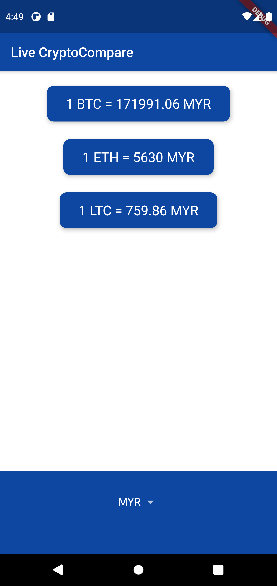

# crypto_compare_api
This is learning project to integrate API with your Flutter application.
In this project I used API from <https://min-api.cryptocompare.com/> to display real time 
cryptocurrencies price.

 
